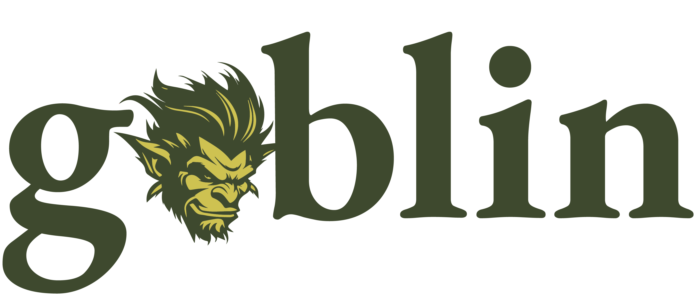

<picture>
  
</picture>

# Goblin Programming Language

A programming language designed for e-commerce automation, 
with built-in money types, currency handling, and product 
templating systems.

*Currently in development. Not ready for public use.*

## Status
- [x] Language specification
- [x] Lexer implementation
- [x] Parser implementation 
- [ ] AST implementation 
- [ ] Interpreter implementation  
- [ ] Glam scaffolding system
- [ ] Real-world testing with Game Goblin Supply

See `spec/` for the complete language specification.
